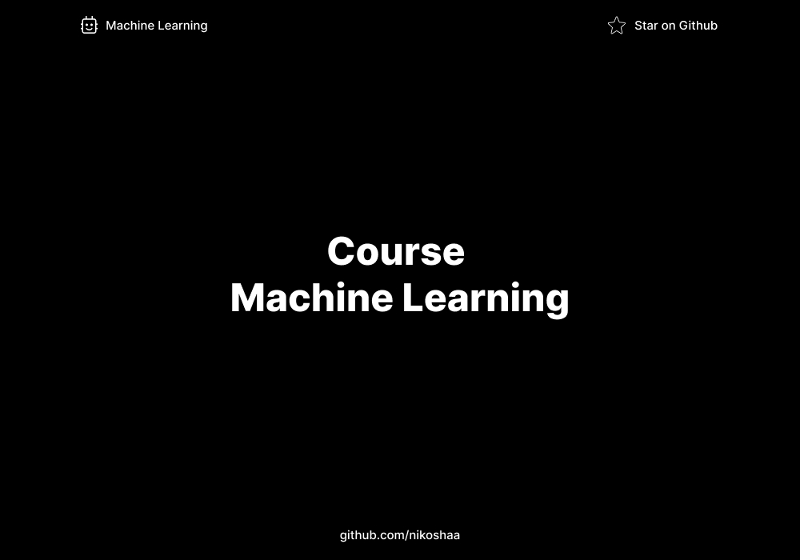

# Machine Learning Course

## Overview

A Machine Learning Course is designed to provide participants with a comprehensive understanding of the principles, techniques, and practical applications of machine learning. 

## License

MIT License
